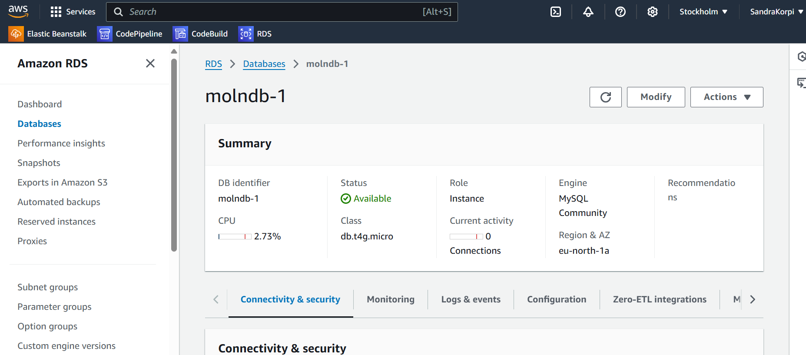
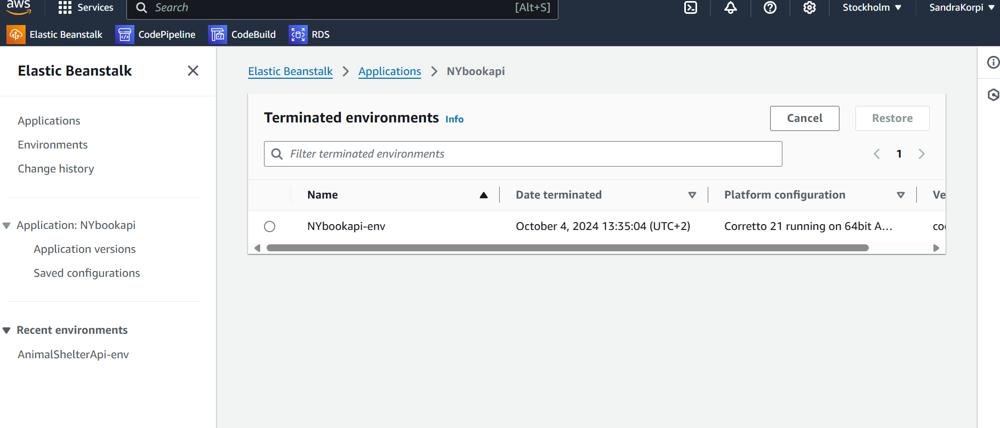
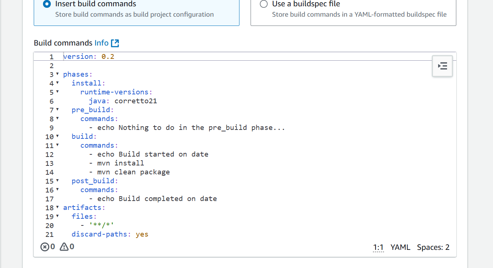
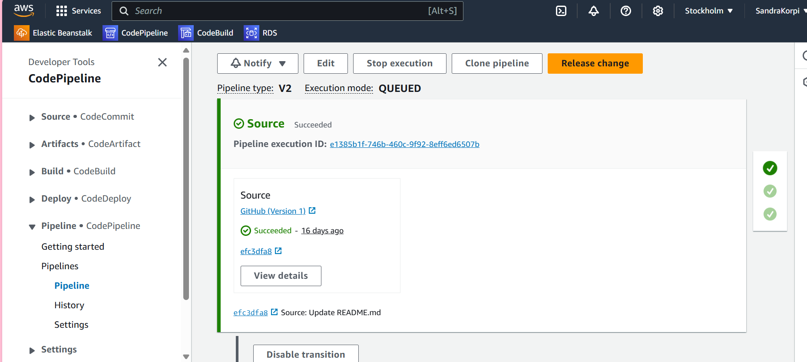

# bookAppMoln
App till kursen molnintegration

Du kommer åt dokumentation och test av api-et utan klient på swaggerlänken:
http://nybookapi-env.eba-i4k2gzqx.eu-north-1.elasticbeanstalk.com/swagger-ui/index.html

Denna tjänst är avsedd för en bokapplikation där användare kan registrera sig och utföra CRUD-operationer mot en databas. Tjänsten använder JWT-token för autentisering av användare. Både tjänsten och databasen är hostade i molnet på Amazon AWS och använder en MySQL-databas.

Såhär såg processen ut att hosta databasen samt serviven på aws:

Jag har skapat en mysql-databas i molnet. Jag har använt anslutningslänken för att koppla upp
till databasen i min workbench samt lagt in länken i application properties.

Sedan har jag skapat en elastic beanstalk samt en serviceroll med 7 olika behörigheter.

Nästa steg var att skapa codebuild. En fil med build-specifikationer för att bygga projektet.

Slutligen har jag skapat en pipeline och kopplat EC2 med GitHub, miljön och allt som behövs för att pipelinen ska köras varje gång projektet får en push till GitHub-repot. 
Då byggs projektet och testerna i projektet körs.
